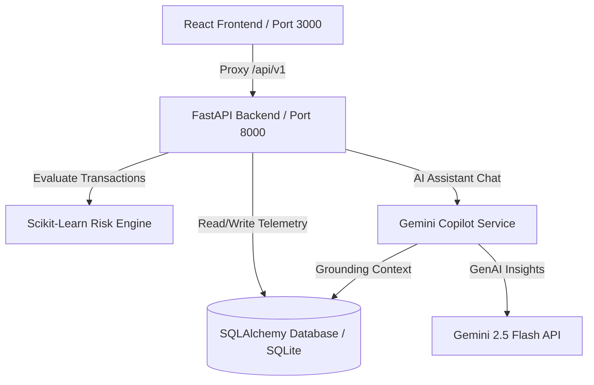

# 🛡️ RiskGuard AI

> **AI-Powered Payment Risk Management, Machine Learning Fraud Detection, and Explainable AI Decision Engine**

RiskGuard AI is a real-time transaction risk scoring and fraud prevention platform. It combines a **Scikit-Learn Random Forest Classifier** with a **rule-based heuristics engine** to calculate risk scores, generate natural language **Explainable AI (XAI)** attributions, and provide an interactive workspace for risk analysts. It also integrates **Google Gemini** as an intelligent Copilot for database insights, customer profiling, and investigation summaries.

---

## 🏗️ Architecture



---

## ✨ Key Features

- **🧠 Hybrid ML & Heuristic Scoring Engine**
  Evaluates transaction risk on a dynamic scale of `0–100` using a Random Forest Classifier trained on synthetic transaction features, layered with weighted rule attributes. The system assesses multiple signals:
  * Transaction amount & frequency velocity.
  * Customer's historical averages and behavior ranges
  * Location changes and geographic anomalies
  * Unrecognized device fingerprints
  * Merchant business category & fraud rate history
  * Account age & odd-hour nighttime transaction anomalies
  * Failed authorization attempts in the last 24 hours

- **🚦 AI Decision Thresholds**
  The engine maps the risk score directly to clear, actionable recommendations :
  * **0–30** ➡️ `APPROVE`
  * **31–60** ➡️ `VERIFY`
  * **61–80** ➡️ `HOLD`
  * **81–100** ➡️ `BLOCK`

- **🔍 Explainable AI (XAI) & Comparison**
  Every risk score is accompanied by a transparent narrative explanation in a dedicated *"Why was this transaction flagged?"* section. It contrasts current transaction details (amount, velocity, device, location) directly against customer normal behavior baselines.

- **⚖️ Product Principle: Risk Signaling vs. Certainty**
  The platform operates under the core principle that **AI Risk Score ≠ Guaranteed Fraud**. It is designed to estimate transaction risk based on signal likelihood, aiding human review and balancing **Fraud Detection vs. False Positives**.

- **💬 Intelligent AI Copilot**
  An integrated chat assistant panel powered by **Gemini 2.5 Flash** (via the `google-genai` SDK) that allows analysts to query database metrics and logs in natural language. Analysts can ask queries like *"Why was TXN-10234 blocked?"*, *"What are the major risk factors for this customer?"*, or *"Summarize this investigation."* Falls back to a local grounded reasoning solver if no Gemini API key is configured.

- **🎛️ Interactive Fraud Simulator**
  Inject and test edge-case payments with customizable sliders (amounts, frequency velocity, device novelty, locations, failed attempts, and account age) to observe real-time scoring and watch classification outcomes instantly adjust.

- **📊 Comprehensive Analytics Dashboard**
  - **Overview**: High-level telemetry showing total transactions, high-risk flags, fraud detected, amount at risk, false positive rates, and average risk score.
  - **Transactions List**: Filterable database of processed payments with full risk factor breakdown and manual override capabilities.
  - **Risk Analysis**: Graphical details showing model weight influences and categorical anomaly rates.
  - **Customer & Merchant Audits**: Deep-dives into spending behaviors, location centers, chargeback records, and fraud exposure rates.

- **💼 Investigation & Case Workflow**
  Escalates critical risk transactions to an analyst workspace case queue, allowing analysts to manually override decisions (saving original AI decision, analyst decision, reason, and timestamp), change case status (from `OPEN` to `RESOLVED`), and log investigation notes.

---

## 🛠️ Tech Stack

### Frontend
- **React 19** & **TypeScript**
- **Vite** (Build Tool)
- **Tailwind CSS** (Styling & Theme)
- **Recharts** (Interactive telemetry & risk charts)
- **Lucide React** (Modern line iconography)

### Backend & Machine Learning
- **FastAPI** (Python framework) & **Uvicorn** (ASGI server)
- **Scikit-Learn** (RandomForestClassifier, StandardScaler)
- **SQLAlchemy** (Object-Relational Mapping)
- **SQLite** (Default local storage via `riskguard.db`)
- **Google GenAI SDK** (Gemini 2.5 Flash integration)

---

## 📁 Project Structure

```
AI Fraud detection/
├── backend/
│   ├── app/
│   │   ├── api/v1/          # FastAPI routers (transactions, risk, copilot, etc.)
│   │   ├── core/            # Config variables, database sessions
│   │   ├── ml/              # Scikit-learn Risk scoring model & features extractor
│   │   ├── models/          # SQLAlchemy SQL models
│   │   ├── schemas/         # Pydantic validation schemas
│   │   ├── services/        # Gemini Copilot engine & database seed helpers
│   │   └── main.py          # FastAPI application entry point
│   ├── .env.example         # Environment template file
│   └── requirements.txt     # Python dependencies
├── src/
│   ├── api/                 # API connection client to FastAPI
│   ├── components/
│   │   ├── common/          # Shared components (badges, toasts)
│   │   ├── copilot/         # Chat drawer sidepanel
│   │   ├── layout/          # Header, Sidebar navigation
│   │   └── views/           # Tab view interfaces (Simulator, Overview, etc.)
│   ├── context/             # Global React state (RiskContext)
│   ├── data/                # Mock generation scripts
│   ├── engine/              # Client-side fallback scoring logic
│   └── App.tsx              # React layout router
├── index.html               # Frontend HTML root
├── package.json             # Node.js dependencies and running scripts
├── vite.config.ts           # Vite server, port, proxy mapping
└── tsconfig.json            # TypeScript build configuration
```

---

## 🚀 Setup & Installation

### 1. Clone & Workspace Setup
Make sure you are in the workspace root directory.

### 2. Backend Setup
1. Navigate to the `backend` directory:
   ```bash
   cd backend
   ```
2. Create and activate a Python virtual environment:
   ```bash
   python -m venv venv
   # On Windows (cmd/powershell):
   .\venv\Scripts\activate
   # On macOS/Linux:
   source venv/bin/activate
   ```
3. Install dependencies:
   ```bash
   pip install -r requirements.txt
   ```
4. Copy the environment file and customize it:
   ```bash
   copy .env.example .env
   ```
5. Open `.env` and configure your API key to enable Gemini features:
   ```env
   GEMINI_API_KEY=your_actual_gemini_api_key_here
   ```

### 3. Frontend Setup
1. Navigate back to the project root:
   ```bash
   cd ..
   ```
2. Install npm packages:
   ```bash
   npm install
   ```

---

## 🏃 Running the Application

You can start the frontend and backend servers separately or run them together concurrently.

### Run Concurrently (Recommended)
From the root workspace directory, run:
```bash
npm run dev:all
```
This script launches:
- **FastAPI Backend Server**: runs on `http://localhost:8000` (API documentation is available at `http://localhost:8000/docs`)
- **Vite React Frontend**: runs on `http://localhost:3000` (automatically proxies requests to backend)

### Run Separately

#### Start Backend Only
```bash
npm run backend
```
*(Runs: `python -m uvicorn backend.app.main:app --host 0.0.0.0 --port 8000 --reload`)*

#### Start Frontend Only
```bash
npm run dev
```
*(Runs: `vite` at `http://localhost:3000`)*
